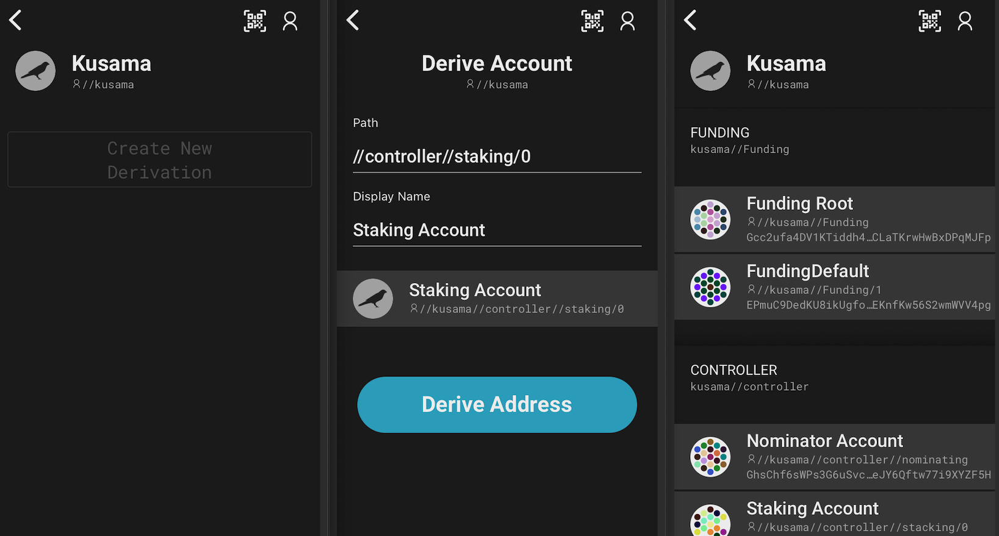

# Parity Signer Accounts Management

Parity Signer v4 has introduced the Hierarchical Deterministic Key Derivation (HDKD) feature for Substrate networks. This article explains how to use this feature.

* Notice: The UI maybe variant for different versions, but the functionalities are the same in v4 version.

## Introduction

Identity is the starting point for generating accounts. Identity is bound to a seed (aka. mnemonic or seed phrase). The identity itself does not have any network affiliation. For Substrate networks, generating a new accounts means entering a derivation path and choosing a network. With this feature, you can manage as many accounts as needed with just one seed phrase safely stored.

## Key Generation

### Create an account for a Substrate based network.

Key generation also refers to accounts creation, with your created Identity:
- Choose a Substrate network, this opens the path list screen.
- Tap `Create New Derivation` Button.
- In path derivation screen, input any path and name you like, the path will be prefixed with its Network path ID, in this example it is `//kusama`.
- Tap `Derive Address` Button.
- From the path list, you will see all the paths and their names within a Substrate network, they are automatically grouped.

### Custom path derivation

To generate a custom path without any prefix path:
- Tap `Add Network Account` on the network list screen.
- Tap `Create Custom Path` button on the bottom.
- Input any path you like.

### Recover Account without derivation Path
If you have created an account without derivation path from Subkey tool, Polkadot.js, or Chrome extension etc. To recover:
- Tap `Add Network Account` on the network list screen.
- Tap `Create Custom Path` button on the bottom.
- Do not input any path, but select a 

### The form of path

Paths also refer to the Chaincodes which described in [BIP32](https://github.com/bitcoin/bips/blob/master/bip-0032.mediawiki/), though it is different from BIP-32 style:
* Soft derivation starts with a single slash, like: `/soft`
* Hard derivation starts with a double slash, like: `//hard`

Users are able to create any combination of hard derivation with `//` and/or soft derivation with `/`.

The encoded string are limited to 32 Bytes.

For technical information about the soft and hard derivations on Substrate, please refer to introduction [here](https://github.com/paritytech/parity-signer/wiki/HDKD-on-Parity-Signer#hdkd-general-on-substrate).

### Further notes

* Ethereum accounts will be generated after an Ethereum network is selected, no path is needed. 
* With the same BIP32 seed users could create accounts under different networks. But if a user has a brain wallet seed, it can only create Ethereum accounts. 
* The pin code is now bound to the identity instead of the account.
* Each derived account is prefixed with its network path id, which prevents it to be misused in another network.

## References:
1. [https://github.com/w3f/schnorrkel](https://github.com/w3f/schnorrkel)
2. [https://wiki.polkadot.network/docs/en/learn-keys](https://wiki.polkadot.network/docs/en/learn-keys)
