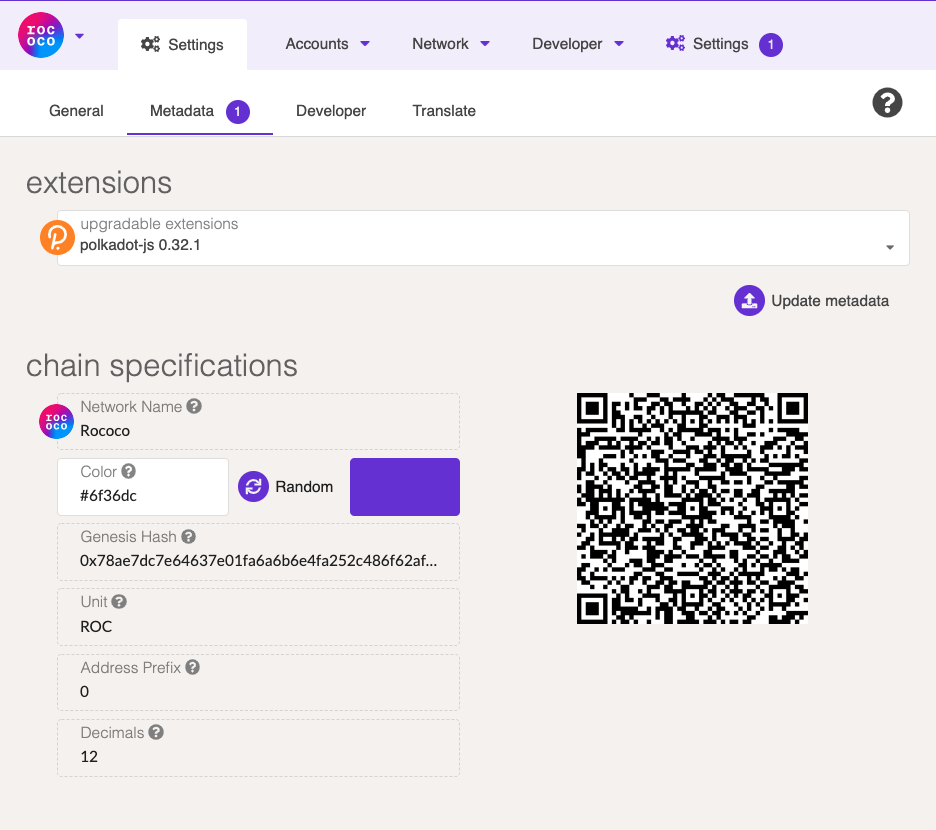
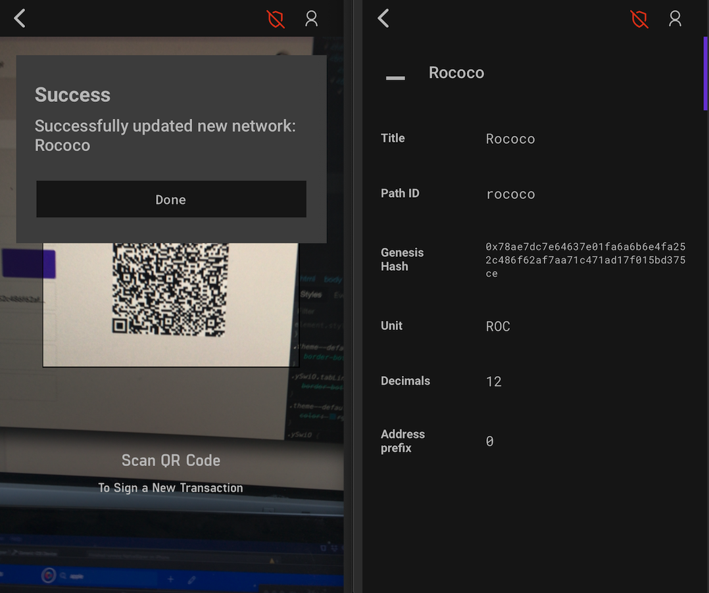

# Update Network Tutorial

Stylo support adding a new Substrate based network or update the existing network via QR code.

This tutorial will walk through how to add a new Rococo Network with Polkadot.js App.

## 1. Get the network metadata as QR Code

Switch to the network you want to play with on Polkadot.js app. Click `Settings` -> `MetaData`

Here we can see the chain specifications like `Network Name`, `Address Prefix`, and `Genesis Hash` etc. They are all the metaData of the network which is required by Stylo. The only item we could change is network color, it is used on Stylo to distinguish other networks. 

On the right side is the QR Code we need.

## 2. Scan metadata QR code with Stylo

Now on the Stylo app, click the QR scanner Button anywhere on the app, and scan this QR code, you will have the new Network added to Stylo. You can now create accounts under it and sign extrinsic with this network. 

Notice since the metadata is generally very big data, and currently, it is hard to sync with Stylo, so when signing the transactions on added networks, we cannot interpreter the extrinsic details at the moment. Please check on this [issue](https://github.com/paritytech/parity-signer/issues/457) for the update.
